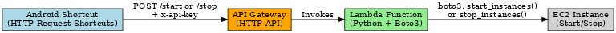

# 📱 One-Tap EC2 Control from Android — Serverless Cloud Automation

This project demonstrates a real-world automation solution: **securely starting or stopping an AWS EC2 instance using a single tap on an Android phone**. Designed with **cost optimization**, **efficiency**, and **mobile control** in mind, this system reflects my ability to design and implement cross-functional automation using AWS and scripting tools.

---

## 🧠 Why I Built This

As a process-focused engineer with a Lean Six Sigma Black Belt, I'm always looking to eliminate waste, automate repetitive tasks, and improve operational control.

> ❓ **Real Problem I Solved**  
> I use an AWS EC2 instance to run a personal VPN server — but only for a few hours daily from my mobile. Keeping the instance running 24/7 was leading to unnecessary cloud costs.  

> ✅ **My Solution**  
> I automated EC2 control using a mobile shortcut that securely starts/stops the instance with a single tap. It now only runs when needed — saving time, effort, and money.

> 💡 **Additional Use Cases**  
> - Developers who want to start/stage cloud test servers temporarily  
> - Freelancers running project-specific compute (e.g., scraping, rendering)  
> - Students or tech enthusiasts running learning environments or remote tools  
> - Lightweight game servers or bot hosting  
> - IoT device testing on-demand

---

## 🧰 Tech Stack & Skills Demonstrated

| Area | Tools / Concepts |
|------|------------------|
| Cloud Functions | AWS Lambda (Python + boto3) |
| API Access | Amazon API Gateway (HTTP API) |
| Security | IAM Roles with least privilege access |
| Mobile Interface | HTTP Request Shortcuts (Android) |
| Scripting | Python (boto3), JSON policies |
| Architecture | Serverless design, CloudWatch monitoring |
| Process Thinking | Automated trigger, time savings, risk reduction |

---

## 🔧 System Workflow

```
[ Android Shortcut ]
        |
        v
[ API Gateway ] ← Secured by x-api-key
        |
        v
[ Lambda Function ] ← start_instance.py / stop_instance.py
        |
        v
[ EC2 Instance (Start/Stop) ]
```



---

## ✅ What This System Does

- 🔘 **Start or stop EC2** instance instantly from mobile
- 🔐 Secured via **API Gateway + API Key**
- 💡 **No AWS Console access needed**
- ☁️ Fully serverless and scalable
- 🕐 Optimized for speed and cost control

---

## 📄 Files Included

| File | Purpose |
|------|---------|
| `/lambda/start_instance.py` | Starts the EC2 instance via boto3 |
| `/lambda/stop_instance.py`  | Stops the EC2 instance securely |
| `iam_policy.json`           | IAM policy scoped to a specific EC2 instance |
| `api_gateway_config.md`     | Step-by-step instructions to configure API Gateway |
| `android_shortcut_setup.md` | Android app setup for one-tap triggering |
| `ec2_architecture_diagram.png` | Project architecture |
| `README.md`                 | This file, with detailed documentation |

---

## 🏆 Key Accomplishments

- ✅ Designed and deployed a **complete cloud-based automation system**
- ✅ Solved authentication, permission, and deployment issues independently
- ✅ Applied **process automation principles** beyond traditional industries
- ✅ Developed with **security best practices** (least-privilege, API Key control)
- ✅ Combined cloud, mobile, and scripting tools in a production-ready setup

---

## 🔗 Connect With Me

Built by [Rehan Ahmad](https://www.linkedin.com/in/rehanxahmad)
- 📧 [rehanrao05@gmail.com](mailto:rehanrao05@gmail.com)
- 📞 [+91-9068797777](tel:+919068797777)

Feel free to connect if you'd like a live walkthrough or implementation help.

---

## 📌 Future Enhancements

- ✅ Add instance status check via Lambda response
- 🔄 Combine start/stop into a toggle function
- 📊 Monitor usage with AWS CloudWatch Metrics
- 🔐 Upgrade to token-based or Cognito-based authentication

---

## 📁 How to Use This Project

1. Set up AWS IAM and EC2 instance
2. Deploy both Lambda functions
3. Configure API Gateway with `/start` and `/stop` routes
4. Enable API Key and usage plan
5. Install HTTP Request Shortcuts on Android
6. Trigger EC2 control with one tap!

---

This project reflects my initiative to **combine cloud technology with user-friendly automation**, bridging technical execution with process efficiency.
